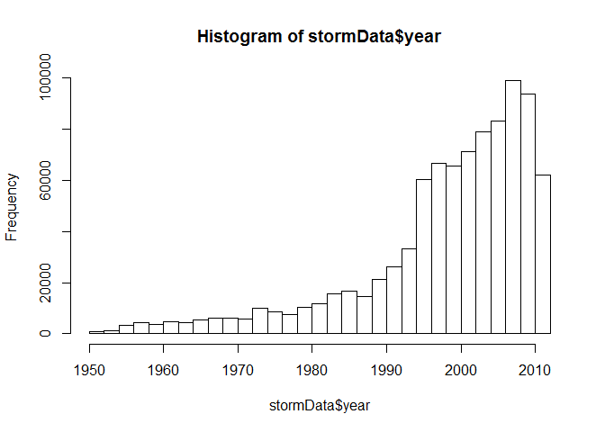
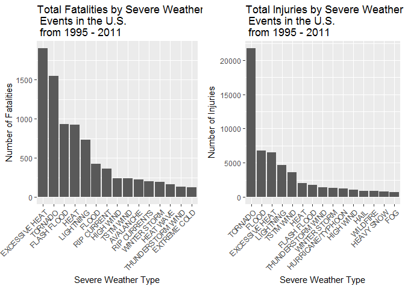

# Reproducible Research: Peer Assessment 2

Reproducible Research: Peer Assessment 2
==========================================
Created by Joel Stell on June 11, 2017

## Impact of Severe Weather Events on Public Health and Economy in the United States

### Synonpsis  
In this report, we aim to analyze the impact of different weather events on public health and economy based on the storm database collected from the U.S. National Oceanic and Atmospheric Administration's (NOAA) from 1950 - 2011. We will use the estimates of fatalities, injuries, property and crop damage to decide which types of event are most harmful to the population health and economy. From these data, we found that excessive heat and tornado are most harmful with respect to population health, while flood, drought, and hurricane/typhoon have the greatest economic consequences.

### Basic settings

```r
echo = TRUE #Always make code visible
options(scipen = 1) #Turn off scienctific notation for numbers
library(R.utils)
```

```
## Loading required package: R.oo
```

```
## Loading required package: R.methodsS3
```

```
## R.methodsS3 v1.7.1 (2016-02-15) successfully loaded. See ?R.methodsS3 for help.
```

```
## R.oo v1.21.0 (2016-10-30) successfully loaded. See ?R.oo for help.
```

```
## 
## Attaching package: 'R.oo'
```

```
## The following objects are masked from 'package:methods':
## 
##     getClasses, getMethods
```

```
## The following objects are masked from 'package:base':
## 
##     attach, detach, gc, load, save
```

```
## R.utils v2.5.0 (2016-11-07) successfully loaded. See ?R.utils for help.
```

```
## 
## Attaching package: 'R.utils'
```

```
## The following object is masked from 'package:utils':
## 
##     timestamp
```

```
## The following objects are masked from 'package:base':
## 
##     cat, commandArgs, getOption, inherits, isOpen, parse, warnings
```

```r
library(ggplot2)
```

```
## Warning: package 'ggplot2' was built under R version 3.3.3
```

```r
library(plyr)
require(gridExtra)
```

```
## Loading required package: gridExtra
```

```
## Warning: package 'gridExtra' was built under R version 3.3.3
```
### Data Processing
First, we download the file and unzip it


```r
if (!"stormData.csv.bz2" %in% dir()) {
    print("hhhh")
    download.file("http://d396qusza40orc.cloudfront.net/repdata%2Fdata%2FStormData.csv.bz2", destfile = "stormData.csv.bz2")
    bunzip2("stormData.csv.bz2", overwrite=T, remove=F)
}
```
Then we read the generated csv file. If the data already exists in the working environment, we do not need to load it again. Otherwise, we read the csv file.

  # unzip bz2 file to csv

```r
  if(!file.exists("stormData.csv")){
    filePath <- "stormData.bz2"
    destPath <- "stormData.csv"
    bunzip2(filePath,destPath,overwrite=TRUE, remove=FALSE)
  }
```

Look at the data

```r
stormData <- read.csv("stormData.csv", sep = ",", na.strings = "..")

dim(stormData)
```

```
## [1] 902297     37
```


```r
head(stormData, n =2)
```

```
##   STATE__          BGN_DATE BGN_TIME TIME_ZONE COUNTY COUNTYNAME STATE
## 1       1 4/18/1950 0:00:00     0130       CST     97     MOBILE    AL
## 2       1 4/18/1950 0:00:00     0145       CST      3    BALDWIN    AL
##    EVTYPE BGN_RANGE BGN_AZI BGN_LOCATI END_DATE END_TIME COUNTY_END
## 1 TORNADO         0                                               0
## 2 TORNADO         0                                               0
##   COUNTYENDN END_RANGE END_AZI END_LOCATI LENGTH WIDTH F MAG FATALITIES
## 1         NA         0                        14   100 3   0          0
## 2         NA         0                         2   150 2   0          0
##   INJURIES PROPDMG PROPDMGEXP CROPDMG CROPDMGEXP WFO STATEOFFIC ZONENAMES
## 1       15    25.0          K       0                                    
## 2        0     2.5          K       0                                    
##   LATITUDE LONGITUDE LATITUDE_E LONGITUDE_ REMARKS REFNUM
## 1     3040      8812       3051       8806              1
## 2     3042      8755          0          0              2
```

The events in the database start in the year 1950 and end in November 2011. In the earlier years of the database there are generally fewer events recorded, most likely due to a lack of good records. More recent years should be considered complete.


```r
if (dim(stormData)[2] == 37){
        stormData$year <- as.numeric(format(as.Date(stormData$BGN_DATE, format = "%m/%d/%Y %H:%M:%S"), "%Y"))
}
hist(stormData$year, breaks = 30)
```

<!-- -->

Based on the above histogram, we see that the number of events tracked starts to significantly increase around 1995. So, we use the subset of the data from 1990 to 2011 to get most out. 


```r
storm <- stormData[stormData$year >= 1995, ]
dim(storm)
```

```
## [1] 681500     38
```
Now there are 681500 rows and 38 columns.


```r
sortHelper <- function(fieldName, top = 15, dataset = stormData) {
    index <- which(colnames(dataset) == fieldName)
    field <- aggregate(dataset[, index], by = list(dataset$EVTYPE), FUN = "sum")
    names(field) <- c("EVTYPE", fieldName)
    field <- arrange(field, field[, 2], decreasing = T)
    field <- head(field, n = top)
    field <- within(field, EVTYPE <- factor(x = EVTYPE, levels = field$EVTYPE))
    return(field)
}

fatalities <- sortHelper("FATALITIES", dataset = storm)
injuries <- sortHelper("INJURIES", dataset = storm)
```
#### Impact on Public Health
In this section, we check the number of **fatalities** and **injuries** that are caused by the severe weather events. We would like to get the first 15 most severe types of weather events.


```r
convertHelper <- function(dataset = storm, fieldName, newFieldName) {
    totalLen <- dim(dataset)[2]
    index <- which(colnames(dataset) == fieldName)
    dataset[, index] <- as.character(dataset[, index])
    logic <- !is.na(toupper(dataset[, index]))
    dataset[logic & toupper(dataset[, index]) == "B", index] <- "9"
    dataset[logic & toupper(dataset[, index]) == "M", index] <- "6"
    dataset[logic & toupper(dataset[, index]) == "K", index] <- "3"
    dataset[logic & toupper(dataset[, index]) == "H", index] <- "2"
    dataset[logic & toupper(dataset[, index]) == "", index] <- "0"
    dataset[, index] <- as.numeric(dataset[, index])
    dataset[is.na(dataset[, index]), index] <- 0
    dataset <- cbind(dataset, dataset[, index - 1] * 10^dataset[, index])
    names(dataset)[totalLen + 1] <- newFieldName
    return(dataset)
}

storm <- convertHelper(storm, "PROPDMGEXP", "propertyDamage")
```

```
## Warning in convertHelper(storm, "PROPDMGEXP", "propertyDamage"): NAs
## introduced by coercion
```

```r
storm <- convertHelper(storm, "CROPDMGEXP", "cropDamage")
```

```
## Warning in convertHelper(storm, "CROPDMGEXP", "cropDamage"): NAs introduced
## by coercion
```


```r
names(storm)
```

```
##  [1] "STATE__"        "BGN_DATE"       "BGN_TIME"       "TIME_ZONE"     
##  [5] "COUNTY"         "COUNTYNAME"     "STATE"          "EVTYPE"        
##  [9] "BGN_RANGE"      "BGN_AZI"        "BGN_LOCATI"     "END_DATE"      
## [13] "END_TIME"       "COUNTY_END"     "COUNTYENDN"     "END_RANGE"     
## [17] "END_AZI"        "END_LOCATI"     "LENGTH"         "WIDTH"         
## [21] "F"              "MAG"            "FATALITIES"     "INJURIES"      
## [25] "PROPDMG"        "PROPDMGEXP"     "CROPDMG"        "CROPDMGEXP"    
## [29] "WFO"            "STATEOFFIC"     "ZONENAMES"      "LATITUDE"      
## [33] "LONGITUDE"      "LATITUDE_E"     "LONGITUDE_"     "REMARKS"       
## [37] "REFNUM"         "year"           "propertyDamage" "cropDamage"
```


#### Impact on Economy
We will convert the **property damage** and **crop damage** data into comparable numerical forms according to the meaning of units described in the code book ([Storm Events])
(http://ire.org/nicar/database-library/databases/storm-events/)). Both `PROPDMGEXP` and `CROPDMGEXP` columns record a multiplier for each observation where we have Hundred (H), Thousand (K), Million (M) and Billion (B).


```r
options(scipen=999)
property <- sortHelper("propertyDamage", dataset = storm)
crop <- sortHelper("cropDamage", dataset = storm)
```


```r
fatalities
```

```
##               EVTYPE FATALITIES
## 1     EXCESSIVE HEAT       1903
## 2            TORNADO       1545
## 3        FLASH FLOOD        934
## 4               HEAT        924
## 5          LIGHTNING        729
## 6              FLOOD        423
## 7        RIP CURRENT        360
## 8          HIGH WIND        241
## 9          TSTM WIND        241
## 10         AVALANCHE        223
## 11      RIP CURRENTS        204
## 12      WINTER STORM        195
## 13         HEAT WAVE        161
## 14 THUNDERSTORM WIND        131
## 15      EXTREME COLD        126
```


```r
injuries
```

```
##               EVTYPE INJURIES
## 1            TORNADO    21765
## 2              FLOOD     6769
## 3     EXCESSIVE HEAT     6525
## 4          LIGHTNING     4631
## 5          TSTM WIND     3630
## 6               HEAT     2030
## 7        FLASH FLOOD     1734
## 8  THUNDERSTORM WIND     1426
## 9       WINTER STORM     1298
## 10 HURRICANE/TYPHOON     1275
## 11         HIGH WIND     1093
## 12              HAIL      916
## 13          WILDFIRE      911
## 14        HEAVY SNOW      751
## 15               FOG      718
```

And the following is a pair of graphs of total fatalities and total injuries affected by those severe weather events. 


```r
fatalitiesPlot <- qplot(EVTYPE, data = fatalities, weight = FATALITIES, stat = "count", width = 1) + 
    scale_y_continuous("Number of Fatalities") + 
    theme(axis.text.x = element_text(angle = 45, 
    hjust = 1)) + xlab("Severe Weather Type") + 
    ggtitle("Total Fatalities by Severe Weather\n Events in the U.S.\n from 1995 - 2011")
```

```
## Warning: `stat` is deprecated
```

```r
injuriesPlot <- qplot(EVTYPE, data = injuries, weight = INJURIES, stat = "count", width = 1) + 
    scale_y_continuous("Number of Injuries") + 
    theme(axis.text.x = element_text(angle = 45, 
    hjust = 1)) + xlab("Severe Weather Type") + 
    ggtitle("Total Injuries by Severe Weather\n Events in the U.S.\n from 1995 - 2011")
```

```
## Warning: `stat` is deprecated
```

```r
grid.arrange(fatalitiesPlot, injuriesPlot, ncol = 2)
```

<!-- -->

Based on the above histograms, we find that **flood** and **hurricane/typhoon** cause most property damage; **drought** and **flood** causes most crop damage in the United States from 1995 to 2011.

### Conclusion
From these data, we found that **excessive heat** and **tornado** are most harmful with respect to population health, while **flood**, **drought**, and **hurricane/typhoon** have the greatest economic consequences.From these data. we found that **excessive heat**
